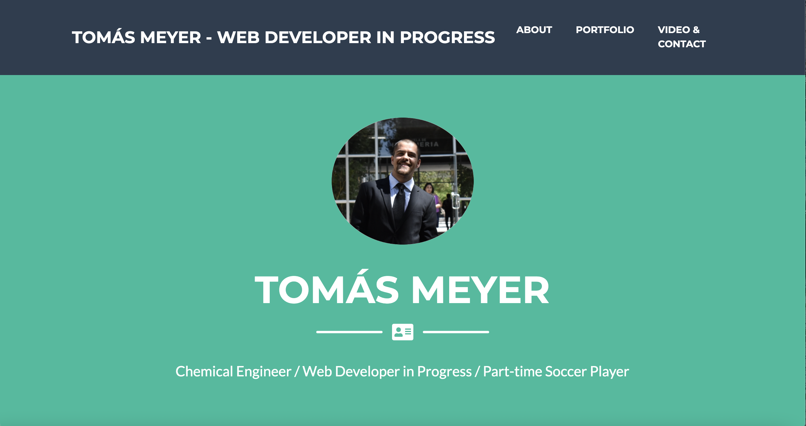

# tfmeyermunoz.github.io
This is my first repository associated to the MIT Javascript course.
# The base for my landing page can be found at [Start Bootstrap - Freelancer](https://startbootstrap.com/theme/freelancer/)

[Freelancer](https://startbootstrap.com/theme/freelancer/) is a one page, freelancer portfolio theme built with [Bootstrap](https://getbootstrap.com/) created by [Start Bootstrap](https://startbootstrap.com/). This theme features several content sections, a responsive portfolio grid, modal windows for each portfolio item, and a working PHP based contact form.

## Preview

**[View Live Preview](https://startbootstrap.github.io/startbootstrap-freelancer/)**

## Status

## Download and Installation

To begin using this template, choose one of the following options to get started:

- [Download the latest release on Start Bootstrap](https://startbootstrap.com/theme/freelancer/)
- Install using npm: `npm i startbootstrap-freelancer`
- Clone the repo: `git clone https://github.com/StartBootstrap/startbootstrap-freelancer.git`
- [Fork, Clone, or Download on GitHub](https://github.com/StartBootstrap/startbootstrap-freelancer)

## Usage

### Basic Usage

After downloading, simply edit the HTML and CSS files included with `dist` directory. These are the only files you need to worry about, you can ignore everything else! To preview the changes you make to the code, you can open the `index.html` file in your web browser.
